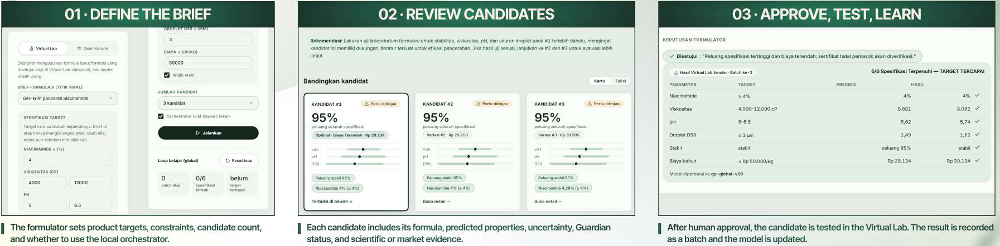
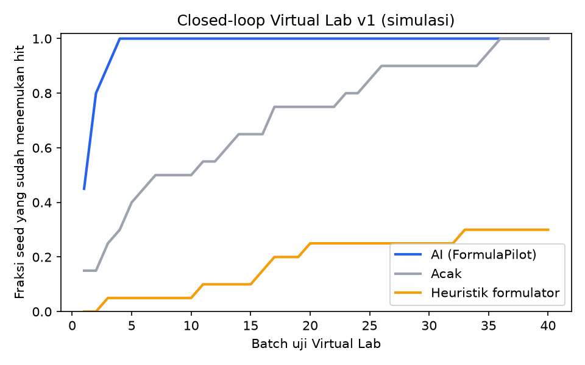
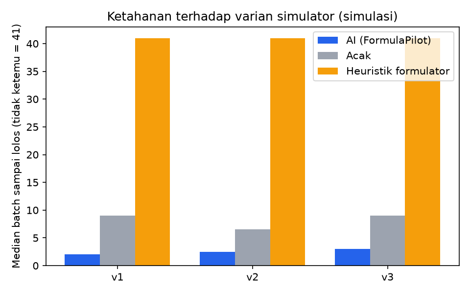
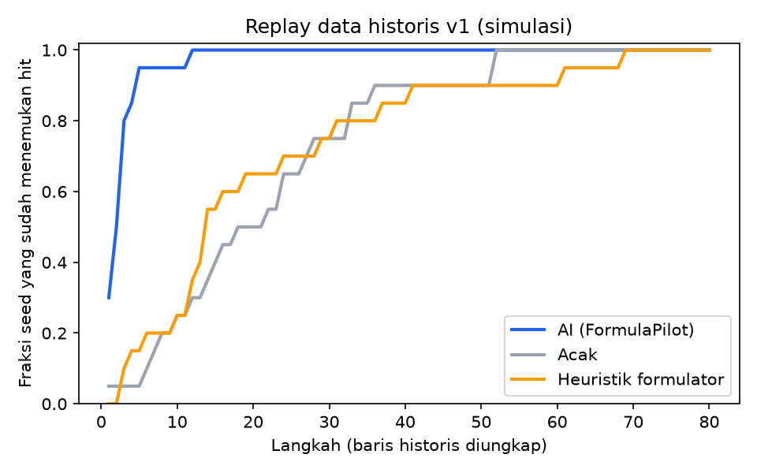
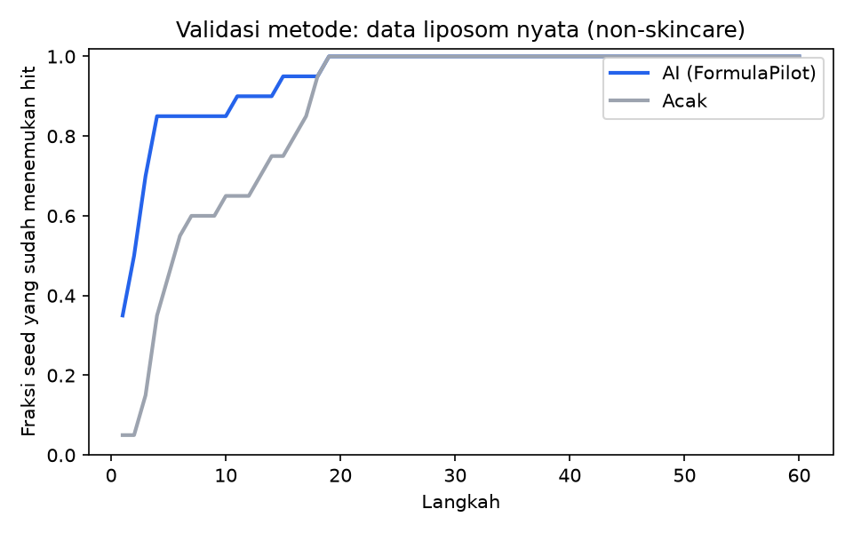

# Rimula Agents

**An AI co-pilot for skincare formulation R&D.** Given a product brief (target viscosity, pH, droplet size, stability, active-ingredient claim, cost ceiling), it proposes the next formulas to make, estimates the probability that each one meets every spec, checks them against ingredient limits and regulatory and halal-sourcing notes, attaches literature and real-product evidence, and retrains after every lab result. The formulator approves every experiment.

> Don't just find a formula. Find the next experiment.

Built in 24 hours by team **Codingbang** at **UI Hackathon Incubate 2026** (PT Paragon Technology and Innovation challenge: "AI untuk Riset & Prediksi Formulasi"), 17 to 18 September 2026. It ran live on a Lintasarta Deka Notebook (NVIDIA L40S). **Selected as one of the top 10 of 30 finalist teams** (78 teams registered).

> **Honesty note.** The challenge partner provided no data, so training and the demo run on a **Virtual Lab**: a simulator the team wrote, with open equations whose directional relationships follow the formulation literature ([model card](docs/virtual-lab-model-card.md)). Its numbers are not real lab results. The method is validated separately on a **real published lab dataset** (liposome microfluidics, Zenodo 17867478). All cost and time savings are simulated.



## How it works

```
Product brief (targets + constraints)
      │
      ▼
Designer ── 4 Gaussian Process models + Bayesian optimization over 30,000 sampled formulas
      │     → n candidates with 95% intervals and P(meets each spec)
      ▼
Guardian ── deterministic rules: palette bounds, claim, budget, regulatory limits,
      │     halal-sourcing flags, extrapolation and uncertainty checks → pass / review / blocked
      ▼
Scout ───── literature (Europe PMC, bge-m3 embeddings) + real products (Open Beauty Facts)
      │
      ▼
Formulator approves or rejects ──► test in the Virtual Lab (explore) or reveal hidden history (replay)
      │
      ▼
Designer retrains (~1 s, warm start) ──► next candidates
```

An optional **orchestrator** runs **Qwen3-30B-A3B locally** (llama.cpp on a 12 GB GPU) and drives the three agents through tool calling. The LLM never produces numbers: it refers to candidates by ID, and every number in its summaries is checked against the tool outputs. Summaries with unverified numbers or forbidden claims ("halal", "safe", "BPOM-approved", "guaranteed") are rejected and replaced by a deterministic template. If the LLM is down or times out, the whole flow still completes in a degraded mode. No external LLM API is used, so formulation data never leaves the machine.

## Results

All numbers come from [`artifacts/evaluation.json`](artifacts/evaluation.json) (`python -m fp.evaluate --all`, 20 seeds).

**Batches needed to reach a formula that meets every spec** (median, lower is better):

| Scenario | AI (Rimula) | Random | One-factor-at-a-time heuristic |
|---|---|---|---|
| Closed loop, simulator v1 | **2** | 9 | 41 (found in 30% of seeds) |
| Closed loop, simulator v2 (perturbed coefficients) | **2.5** | 6.5 | 41 (20%) |
| Closed loop, simulator v3 (new interactions, 1.5× noise) | **3** | 9 | 41 (30%) |
| Replay on 400 historical records | **2.5** | 20 | 14 |
| **Real lab data:** liposome size and PDI target, 306 formulations | **2.5** | 6 | n/a |

The AI loop needed 62 to 78% fewer batches than random across the three simulator variants, and 88% fewer on historical replay.

**Model quality** (5-fold cross-validation, 400 records): viscosity R² 0.99, pH R² 0.95, droplet R² 0.96, stability AUC 0.93 (Brier 0.065 against a 0.209 baseline). The 95% intervals cover 94 to 95% of held-out points, so the reported uncertainty is calibrated.

| Closed loop, simulator v1 | Robustness across simulator variants |
|---|---|
|  |  |
| **Replay on historical data** | **Validation on real liposome data** |
|  |  |

## Tech stack

| Layer | Tools |
|---|---|
| Models | scikit-learn Gaussian Processes (Matérn ARD kernels), Bayesian optimization with a diversity constraint, SciPy |
| Agents | Python Designer, Guardian and Scout modules; Qwen3-30B-A3B through llama.cpp (OpenAI-compatible tool calling) |
| Evidence | Europe PMC REST API + `BAAI/bge-m3` embeddings (TF-IDF fallback); Open Beauty Facts product dump |
| Backend | FastAPI, Pydantic v2 contracts, SQLite per instance, background run threads with event polling, optional APScheduler |
| Frontend | React 18, TypeScript, Vite, Tailwind CSS, TanStack Query, Recharts |
| Infra | JupyterLab on Kubernetes (NVIDIA L40S capped at 12 GB VRAM, 16 cores) |
| Tests | pytest backend suite with a scripted fake LLM and an opt-in live-LLM test |

## Repository layout

```
fp/                 core package
  designer.py       GP models + Bayesian optimization (propose, rank_pool, warm-start fit)
  virtual_lab.py    simulator (3 variants) · palette.py · datagen.py
  guardian.py       rule engine · scout.py literature · market.py Open Beauty Facts
  evaluate.py       cross-validation, closed loop, replay, liposome validation, savings, figures
  orchestrator/     LLM loop, tool definitions, prompts, anti-hallucination validator, templates
  schemas.py        frozen data contract (Pydantic)
backend/app/        FastAPI app: runs, candidates, lab tests and retraining, replay, agents, evaluation
backend/tests/      pytest suite
frontend/           React UI (Experiment, Evidence, Agents & Research tabs)
contracts/          API contract + JSON fixtures the frontend was built against
data/               assumptions (palette, briefs, regulatory table) + synthetic Virtual Lab history
artifacts/          evaluation.json + figures (models and indexes are rebuilt, see below)
scripts/            setup, data, training, evaluation, dev and demo servers, release, smoke test, llm/
docs/               model card, sources and licenses, QA evidence, member explainers, pitch materials
```

## Running it

Linux, Python 3.13. A GPU is optional (only for the LLM and the embedding build).

```bash
cp .env.example .env
bash scripts/setup_env.sh                             # Python venv + Node 22
FP_MEMBER=david source scripts/env.sh                 # per-member port and runtime folder

bash scripts/heavy.sh bash scripts/fetch_data.sh      # Open Beauty Facts + liposome dataset
bash scripts/heavy.sh bash scripts/generate_data.sh   # synthetic Virtual Lab history (v1, v2, v3)
bash scripts/heavy.sh bash scripts/train.sh           # base model gp-global-v1 (~35 s)
bash scripts/heavy.sh bash scripts/build_scout.sh     # market statistics + literature index
bash scripts/heavy.sh bash scripts/evaluate.sh        # evaluation.json + figures (~2 min)
bash scripts/heavy.sh bash scripts/build_frontend.sh  # frontend/dist

bash scripts/llm/setup_llm.sh && bash scripts/llm/start_llm.sh   # optional: local Qwen3 on :8080
bash scripts/dev_up.sh david                          # API + UI, Swagger at /docs
pytest -q backend/tests
```

The scripts follow the event's layout (`~/work/formulapilot` on one shared machine, one port per team member). `scripts/heavy.sh` is a global queue that kept four people's CPU-heavy jobs from colliding on 16 shared cores.

### Data and artifacts

Excluded from the repository and rebuilt by the scripts above:

- **Open Beauty Facts dump and derived statistics** (`data/market/`, `artifacts/market/`): ODbL share-alike data, downloaded by `fetch_data.sh` and rebuilt by `build_scout.sh`.
- **Europe PMC abstracts and embeddings** (`artifacts/scout/`): rebuilt by `build_scout.sh`.
- **Trained models** (`artifacts/models/`): rebuilt by `train.sh`.

Included: the team's synthetic Virtual Lab data, the cleaned liposome table (CC BY 4.0, attributed in [sources and licenses](docs/sources-and-licenses.md)), and the evaluation results and figures.

## Team Codingbang

| Member | Role |
|---|---|
| **Nicholas Edmund** | Team lead, AI safety and ops: Guardian rules (regulatory limits, halal-source flags), Scout evidence from Europe PMC and Open Beauty Facts, server release and demo operations, pitch deck |
| **Marshal Aufa** | Machine learning and business: Designer agent (multi-output Gaussian Process with Bayesian optimization), Virtual Lab simulator, evaluation benchmarks, business case |
| **Tubagus Dafa** | Frontend and product UX: formulator dashboard (React + Vite), candidate cards with 95% intervals, live agent timeline, evidence and evaluation tabs |
| **David Alexander** | Backend and local LLM: FastAPI backend and data contracts, Qwen3-30B orchestrator with tool calling and anti-hallucination validation, llama.cpp on GPU |

Each member's write-up is in [`docs/explainers/`](docs/explainers/) (Indonesian).

**How four people and four AI agents built it without Git.** The team worked directly on one shared server. Each member drove their own AI coding agent under a strict file-ownership table, with a data contract frozen in the first hour, stub modules so everyone could build in parallel, a file-based request queue for cross-team changes, and a global queue for heavy jobs. The rules every agent followed are in [`docs/team-process/AGENT_RULES.md`](docs/team-process/AGENT_RULES.md). This repository is a cleaned snapshot of that working tree, published after the event.

## Pitch materials

- [Final deck (PDF)](docs/pitch/RimulaAgents_CodingBang_deck.pdf)
- [Poster](docs/pitch/poster.jpg)
- [Original team README (Indonesian)](docs/README.id.md)

## License

Code: [Apache-2.0](LICENSE). Third-party data keeps its own license; see [`docs/sources-and-licenses.md`](docs/sources-and-licenses.md).
